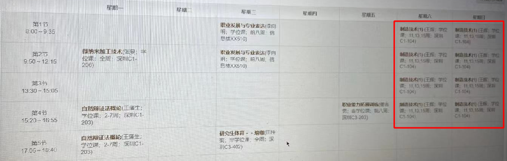

# Shortcuts for Schedule

利用iOS shortcuts 应用，将课程表添加到日程。

## Presentation

默认设定在课程开始前30分钟发出提醒。

## Example

该快捷指令一次可以添加一门课程，并且认为在每周同一天上课的地点和周数是一致的。下面给出一个例子。

下面的动图展示了加“制造技术”门课的操作步骤。

 

## Download

由于快捷指令中，没有函数的概念，只能利用多个快捷指令的调用保证逻辑清晰。
需要将下面四个快捷指令均安装，才能正常运行。

[删除日程](https://www.icloud.com/shortcuts/9388b9a1387f483a94a2510c22919581)  
[获得上课周列表](https://www.icloud.com/shortcuts/6853b7414f2e4a65939a03ff975092ed)  
[添加星期X课程](https://www.icloud.com/shortcuts/cc90055edd714811ad1457b7efd84d97)  
[添加一门课Ver2.0](https://www.icloud.com/shortcuts/9a99989cfaf54a0fa7ce319de9f17483)  

## Usage

### 设置基本信息

为了适配不同学校和年级的上课信息，使用之前需要手动设置一些基本信息。  
编辑“添加一门课Ver2”，按照提示更改第一个字典即可。  
 
 
- 第一周周一日期：请到教务处查询相应日期，快捷指令会自动计算周数对应的日期
- 学期总周数：这个参数用来确定删除课程时查找的范围，如果你的一学期的周数小于20 则不需要改动
- 一节课持续时间：单位分钟。这个用来确定下课时间的。
- 日历名称：会在你的日历App中建立该名称的日历，可以在日历App中选择日程是否生效。
- 上课时间：点开则有如右侧的菜单编辑，需要更改上课对应的时间。

### 添加一门课

运行“添加一门课Ver2”，按照指示填入信息即可。

### 删除一门课

如果添加了错误的信息，可以根据课程名称查找并删除。

### 删除全部课表

本快捷指令会单独创建一个日历，并添加到该日历中，可以在日历app中删除对应新建的日历，即可删除全部添加的课程。

## LICENSE
[GPL-3.0](LICENSE)
